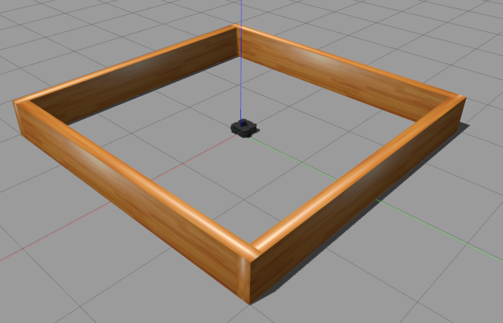
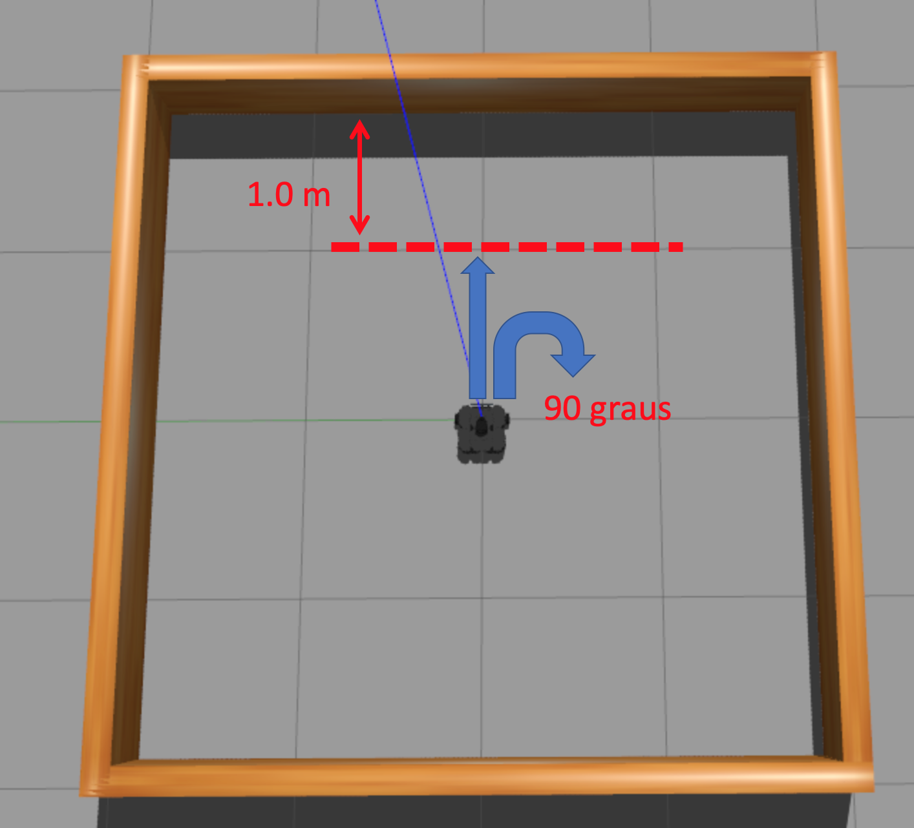

# Robótica Computacional 2020

[Mais orientações no README](./README.md)

## Prova SUB

**Você deve escolher somente 3 questões para fazer. Todo mundo que fizer pelo menos uma questão ganha 0.1**

Nome:_______________

Questões que fez:____________

Observações de avaliações nesta disciplina:

* Inicie a prova no Blackboard para a ferramenta de Proctoring iniciar. Só finalize o Blackboard quando enviar a prova via Github classroom
* Tenha os repositórios https://github.com/Insper/robot202/ e https://github.com/arnaldojr/my_simulation atualizados em seu catkin_ws/src .
* Você pode consultar a internet ou qualquer material, mas não pode se comunicar com pessoas ou colegas a respeito da prova
* Ponha o nome no enunciado da prova no Github
* Faça commits e pushes frequentes no seu repositório (tem dicas [no final deste arquivo](./inst
rucoes_setup.md))
* Esteja conectado no Teams e pronto para receber calls do professor e da equipe. 
* Avisos importantes serão dados no chat da prova
* Permite-se consultar qualquer material online ou próprio. Não se pode compartilhar informações com colegas durante a prova
* Faça commits frequentes. O primeiro a enviar alguma ideia será considerado autor original
* A responsabilidade por ter o *setup* funcionando é de cada estudante
* Questões de esclarecimento geral podem ser perguntadas no chat do Teams
* Se você estiver em casa pode falar com seus familiares, mas não pode receber ajuda na prova.
* É vedado colaborar ou pedir ajuda a colegas ou qualquer pessoa que conheça os assuntos avaliados nesta prova.

Existe algumas dicas de referência rápida de setup [instrucoes_setup.md](instrucoes_setup.md)

**Integridade Intelectual**

Se você tiver alguma evidência de fraude cometida nesta prova, [use este serviço de e-mail anônimo](https://www.guerrillamail.com/pt/compose)  para informar ao professor.  Ou [este formulário](https://forms.gle/JPhqjPmuKAHxmvwZ9)

# Setup 

Você precisa deste vídeo para a Questão 1: Salve na pasta Q1

[https://github.com/Insper/robot20/raw/master/media/dados.mp4](https://github.com/Insper/robot20/raw/master/media/dados.mp4)

# Questões

## Questão 1  (3.3 pontos)

Você deve fazer um programa que, a cada momento, indica o valor do dado sorteado. 

</img>
#### Orientações

Trabalhe no arquivo `q1/q1.py`. Este exercício **não precisa** de ROS. Portanto pode ser feito até em Mac ou Windows

Você vai notar que este programa roda o vídeo `dados.mp4`. Baixe o vídeo [neste endereço](https://github.com/Insper/robot20/raw/master/media/dados.mp4)

#### O que você deve fazer:

Escrever sobre a janela um número indicando o valor do dado presente na imagem.  O

Quando não houver nada seu programa não precisa escrever coisa alguma.  

|Resultado| Conceito| 
|---|---|
| Não executa | 0 |
| Segmenta ou filtra a imagem baseado em cores ou canais da imagem e produz output visual| 1.5|
| Realiza algum tipo de segmentação de objetos produzindo saída visual| 2.5 |
| Conta sempre certo com output na tela  | 3.5 | 

Casos intermediários ou omissos da rubrica serão decididos pelo professor.

## Questão 2 (3.3 pontos)

Seu robô está dentro de um cômodo como pode ser visto na figura

#### O que é para fazer

Faça o robô ir em frente até chegar a uma distância $x=1m$ da parede. Em seguida faça-o girar à direita um ângulo $90^o$.  

Torne a fazê-lo ir em frente e girar. A cada execução reduza a distância em 5 cm e o ângulo em 5 graus. 

Pare depois que ele tiver feito um giro de 40 graus após ter avançado até chegar a 50cm da parede.  

#### Detalhes de como rodar

O código para este exercício está em: `sub202/scripts/Q2.py`

Para rodar, recomendamos que faça:

    roslaunch turtlebot3_gazebo turtlebot3_stage_1.launch

Depois:

    rosrun sim202 Q2.py

|Resultado| Conceito| 
|---|---|
| Não executa | 0 |
| Consegue filtrar o vermelho | 1.0 |
| Identifica qual o cilindro correto | 2.0 |
| Faz a abordagem baseada em câmera e laser para se aproximar corretamente e para na distância recomendada| 3.33 | 

Casos intermediários ou omissos da rubrica serão decididos pelo professor.

